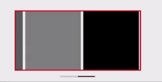
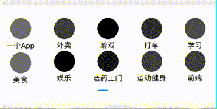

# react-native-custom-scroll-indicator

>React native custom scroll bar (indicator)
>
>RN 自定义滑动指示器（滚动条）

## Installation / 安装

```bash
yarn add react-native-custom-scroll-indicator
```

## Example

[codesandbox](https://codesandbox.io/s/naughty-cohen-je7lf?file=/src/App.js) RN-web 需要点击 **Open In New Windows** 然后用手机模式查看


<br />

<br />



## Usage / 使用

```tsx
import ScrollIndicator from "react-native-custom-scroll-indicator";
```

General / 基础使用

```tsx
<ScrollIndicator
    viewBoxStyle={{
        alignItems: "center",
        marginTop: 60,
        flex: 1
    }} scrollViewBoxStyle={{
        width: undefined
    }}>
    <Content />
</ScrollIndicator>
```

Advanced / 进阶用法

```tsx
<ScrollIndicator
    indicatorBgPadding={6}
    viewBoxStyle={{
        alignItems: "center",
        marginTop: 60
    }}
    indicatorBackgroundStyle={{
        height: 4,
        width: 40,
        borderRadius: 5
    }} indicatorStyle={{
        height: 2,
        width: 40,
        borderRadius: 4
    }} indicatorBoxStyle={{
        marginTop: 10,
        justifyContent: "center",
        alignItems: "center"
    }} scrollViewBoxStyle={{
        borderWidth: 2,
        width: 300,
        borderColor: "red"
    }}>
    <Content />
</ScrollIndicator>
```

## API

|          Props           | Description | Type | Default |
| :----------------------: | :---------: | :--------------------: | :-----: |
|       viewBoxStyle       | entire component View style / 整个组件的样式 | StyleProp\<ViewStyle\> |         |
|    scrollViewBoxStyle    | ScrollView outline style / 被滑动的 ScrollView 外部的 View 的样式 | StyleProp\<ViewStyle\> |  |
|     scrollViewStyle      | ScrollView style /被滑动的 ScrollView 的样式 | StyleProp\<ViewStyle\> |         |
|    indicatorBgPadding    | The sum of the two ends of the indicator background / 指示器的背景两端延伸之和 | number | 0 |
| indicatorBackgroundStyle | Indicator background style / 指示器的背景样式 | StyleProp\<ViewStyle\> | width：140; height: 8; * |
|      indicatorStyle      | Indicator style / 指示器的样式 | StyleProp\<ViewStyle\> | width：20; height: 4; |
|    indicatorBoxStyle     | Indicator outline View style / 指示器外 View 的样式 | StyleProp\<ViewStyle\> | * |
|  alwaysIndicatorBounce   | Always turn on the rebound effect of the indicator / 总是开启指示器的回弹效果 | boolean | false |
| animatedScrollViewParams | Animated.ScrollView params / Animated.ScrollView 的原生参数 | ScrollViewProps |         |
| onScrollListener | Callback when sliding / 滑动时的回调 | (*e*: NativeSyntheticEvent\<unknown\>) =\> void |         |

\* The length of the indicator background defaults to **add** the length of the indicator / 指示器背景的长度默认**加上**指示器的长度

